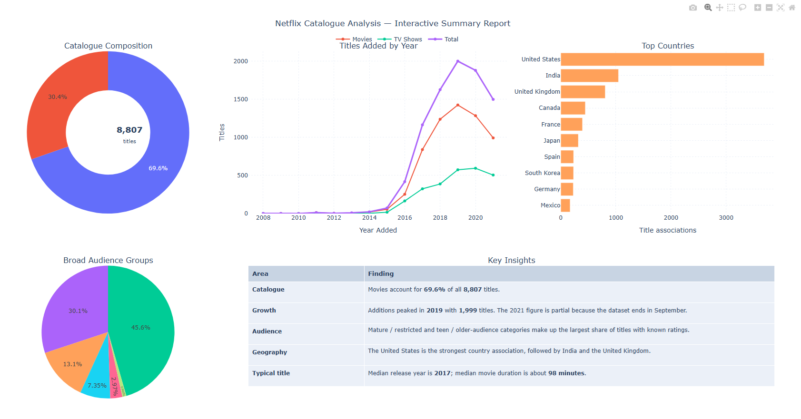

# Netflix Catalogue Analysis
### *(Final hackathon project for the Data Analytics Skills Bootcamp at Cambridge Spark.)*

Exploratory analysis of 8,807 Netflix titles using Python, pandas, SciPy, Matplotlib and Plotly.

## Interactive Dashboard

Click the dashboard preview above to open the interactive Plotly report.

## Project Files

- [View the Jupyter Notebook](Netflix-Catalogue-Analysis.ipynb)

- [Open the Interactive Dashboard](https://jlc-sw.github.io/Hackathon-Netfilx/)

